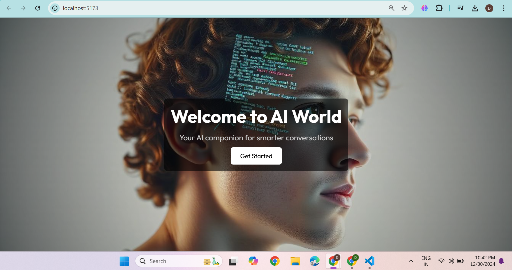
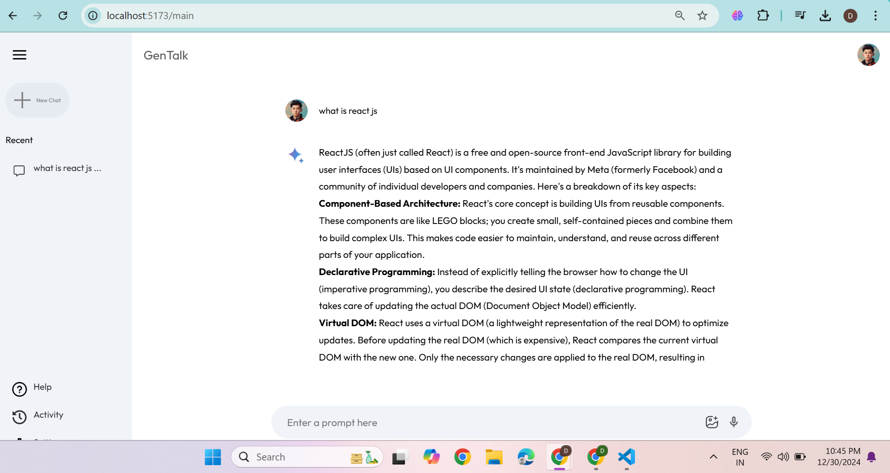

# Gemini Clone

**Project Overview**  
This is a web application designed to replicate the core functionalities of Gemini. Built with React and integrated with the Google Gemini Flash 1.5 API, it provides a seamless, high-performance user experience with an intuitive design.

**Technologies Used**  
- React  
- Google Gemini Flash 1.5 API  
- JavaScript  
- CSS  

**Screenshots**  
Below are some screenshots of the application:  

 
